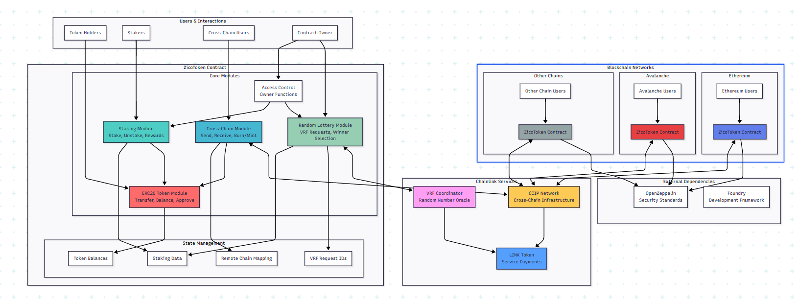

# ZicoAI Token  
A full-stack DApp featuring an ERC-20 token, staking system, raffles, and cross-chain transfers powered by Chainlink.



## 🏗️ System Architecture

### High-Level Overview  
The Zico Token DApp is an end-to-end Web3 ecosystem that blends several advanced blockchain technologies to deliver a utility token with cross-chain capabilities, a staking system with random rewards, and decentralized raffles.

### Main Components  

1. **ZicoToken.sol** – Core Contract  
   ```solidity
   contract ZicoToken is ERC20, Ownable, CCIPReceiver, VRFConsumerBaseV2
   ```
   Features:  
   • **ERC-20 Standard** – 1 M initial supply  
   • **Staking System** – Users lock tokens to earn rewards  
   • **Cross-Chain Bridge** – Chainlink CCIP integration  
   • **Random Rewards** – Lottery mechanism via Chainlink VRF  
   • **Governance** – Access control with OpenZeppelin Ownable  

   Staking architecture:  
   • `mapping(address => uint256) public stakes` – user stakes  
   • `address[] public stakerList` – active stakers  
   • Pro-rata reward distribution  
   • VRF-based random bonuses to boost engagement  

2. **ZicoRaffle.sol** – Raffle Engine  
   ```solidity
   contract ZicoRaffle is VRFConsumerBaseV2, Ownable
   ```  
   Features:  
   • **Participant Management** – Dynamic whitelist  
   • **Fair Selection** – Chainlink VRF for unbiased winners  
   • **Custom Prizes** – Admin-defined rewards  
   • **Treasury Integration** – Payouts executed automatically  

3. **TreasuryVault.sol** – Fund Management  
   ```solidity
   contract TreasuryVault is Ownable
   ```  
   Features:  
   • **Multi-Token Support** – Handles ZICO & LINK  
   • **Fee System** – Automatic protocol fee collection  
   • **Reward Distribution** – Unified payout interface  
   • **Admin Controls** – Withdrawals restricted to owner  

4. **ZICOStaking.sol** – Alternate Staking Pool  
   ```solidity
   contract ZICOStaking is ERC20, Ownable
   ```  
   Features:  
   • **Independent Pool** – Separate reward mechanics  
   • **Auto Reward Calculation** – Proportional distribution  
   • **Claim Functionality** – Manual reward harvesting  

### Chainlink Integration  

• **CCIP (Cross-Chain Interoperability Protocol)**  
  – Burn & Mint model for chain hops  
  – Automatic LINK fee handling  
  – Supports Ethereum, Arbitrum, Polygon, Avalanche  
  – Cryptographic validation & guaranteed finality  

• **VRF (Verifiable Random Function)**  
  – True randomness for raffles & bonuses  
  – On-chain proof of fairness  
  – Asynchronous callback workflow  
  – Gas-efficient configuration options  

### Front-End Architecture

**React Application Stack**
```
Frontend/
├── Components/   # Reusable UI pieces
├── Hooks/        # Web3 logic
├── Utils/        # Helpers & constants
└── Services/     # Contract wrappers
```
Technologies:  
• **Ethers.js** – Core blockchain library  
• **TailwindCSS** – Modern styling framework  
• **React Hooks** – Reactive state management  
• **Toast Notifications** – Transaction feedback  

Web3 Interaction Flow  
1. **Wallet Connection** – Auto-detect & connect MetaMask  
2. **Contract Instances** – Init contracts via providers  
3. **Transaction Handling** – Pending / success / error states  
4. **Real-Time Updates** – Polling & event listeners  

### Security & Governance

• **Access Control** – Ownable & role-based patterns  
• **Emergency Switches** – Pause & emergency withdraw  
• **On-Chain Validation** – Input checks, balance checks, re-entrancy guards  
• **Audit Trail** – Extensive event logging for transparency  

### Protocol Use Cases

For Regular Users  
1. **Passive Staking** – Lock tokens for steady rewards  
2. **Cross-Chain Trading** – Move assets across chains  
3. **Raffle Participation** – Win special prizes  
4. **Yield Farming** – Maximize returns via staking  

For Administrators  
1. **Liquidity Management** – Cross-chain liquidity ops  
2. **Reward Distribution** – Strategic incentive programs  
3. **Protocol Governance** – Adjust key parameters  
4. **Event Management** – Launch & manage special raffles  

### Scalability & Performance

• **Gas Optimization** – Batch ops, storage packing, view functions  
• **Multi-Chain Architecture** – L2 support (Arbitrum, Polygon)  
• **Cross-Chain Composability** – Interop with external protocols  
• **Unified UX** – One interface across multiple chains  

## Project Structure
```
zico-token/
├── contracts/            # Smart contracts (Foundry)
│   ├── src/              # Solidity sources
│   ├── script/           # Deployment scripts
│   ├── test/             # Unit tests
│   └── foundry.toml      # Foundry config
├── frontend/             # React UI
│   ├── src/              # React source
│   ├── public/           # Static assets
│   └── package.json      # NPM deps
├── assets/               # Images & docs
├── .github/              # GitHub Actions
├── setup.sh              # Initial setup script
├── run_all.sh            # One-click runner
└── start_frontend.sh     # Front-end launcher
```

## Features

• **ERC-20 Token** – Advanced ZICO token  
• **Staking System** – Stake & receive random rewards  
• **Raffles** – Chainlink VRF-powered lotteries  
• **Cross-Chain** – CCIP transfers between networks  
• **Web Interface** – Modern, responsive React app  

## Quick Start

1. **Initial Setup**
```bash
./setup.sh
```

2. **Run Everything (Recommended)**
```bash
./run_all.sh
```

3. **Manual Startup**

Terminal 1 – Local Blockchain  
```bash
anvil
```

Terminal 2 – Contract Deployment  
```bash
cd contracts
forge script script/Deploy.s.sol \
  --rpc-url http://127.0.0.1:8545 \
  --private-key 0xac0974bec39a17xyzed5efcae7f4f2ff80 \
  --broadcast
```

Terminal 3 – Front-End  
```bash
./start_frontend.sh
```

## Development

### Contracts
```bash
cd contracts
forge build     # Compile
forge test      # Unit tests
forge fmt       # Format
```

### Front-End
```bash
cd frontend
npm install     # Install deps
npm start       # Dev server
npm run build   # Production build
```

## MetaMask Configuration

• **Network**: Anvil Local  
• **RPC URL**: http://127.0.0.1:8545  
• **Chain ID**: 31337  
• **Currency**: ETH  
• **Private Key**: 0xac0974bec39a17xyzefcae784d7bf4f2ff80  

## Tech Stack

• **Solidity** – Smart contracts  
• **Foundry** – Development framework  
• **React** – User interface  
• **Ethers.js** – Blockchain interaction  
• **Chainlink VRF** – Randomness  
• **Chainlink CCIP** – Cross-chain transfers  
• **TailwindCSS** – Styling
